# Blog Application - Spring Boot Project

JWT 인증과 파일 업로드 기능을 가진 Spring Boot 기반 블로그 애플리케이션입니다.

## 📋 프로젝트 개요

이 프로젝트는 학습 목적으로 설계된 종합적인 Spring Boot 블로그 시스템입니다. 
신입 개발자도 이해할 수 있도록 상세한 주석과 설명이 포함되어 있습니다.

### 주요 기능
- 🔐 JWT 기반 인증/인가 시스템
- 👥 사용자 회원가입/로그인
- 📝 블로그 포스트 작성/관리
- 📎 파일 업로드/다운로드
- 🛡️ 역할 기반 접근 제어 (RBAC)
- 🔍 통합 검색 기능
- 📊 관리자 대시보드

### 기술 스택
- **Backend**: Spring Boot 3.x, Spring Security, Spring Data JPA
- **Database**: PostgreSQL (학습용 MyBatis도 포함)
- **Authentication**: JWT (JSON Web Token)
- **File Storage**: Local File System
- **Testing**: JUnit 5, TestContainers
- **Documentation**: Swagger/OpenAPI 3
- **Build Tool**: Gradle

## 🏗️ 시스템 아키텍처

### 전체 시스템 구조
```
┌─────────────────┐    ┌─────────────────┐    ┌─────────────────┐
│   Frontend      │───▶│   Controller    │───▶│    Service      │
│  (React/Vue)    │    │     Layer       │    │     Layer       │
└─────────────────┘    └─────────────────┘    └─────────────────┘
                                                        │
┌─────────────────┐    ┌─────────────────┐    ┌─────────────────┐
│   JWT Security  │    │   Entity/DTO    │    │   Repository    │
│     Filter      │    │     Layer       │    │     Layer       │
└─────────────────┘    └─────────────────┘    └─────────────────┘
                                                        │
                       ┌─────────────────┐    ┌─────────────────┐
                       │      JPA        │    │   PostgreSQL    │
                       │    Hibernate    │───▶│   Database      │
                       └─────────────────┘    └─────────────────┘
```

## 📊 데이터베이스 ERD (Entity Relationship Diagram)

### ERD 다이어그램

```mermaid
erDiagram
    USER {
        bigint id PK
        varchar username UK
        varchar email UK
        varchar password
        varchar first_name
        varchar last_name
        boolean is_active
        timestamp created_at
        timestamp updated_at
    }
    
    ROLE {
        bigint id PK
        varchar name UK
        varchar description
    }
    
    POST {
        bigint id PK
        varchar title
        text content
        varchar summary
        boolean is_published
        bigint author_id FK
        timestamp created_at
        timestamp updated_at
    }
    
    FILE_ENTITY {
        bigint id PK
        varchar original_name
        varchar stored_name
        varchar file_path
        bigint file_size
        varchar content_type
        bigint uploaded_by FK
        bigint post_id FK
        timestamp created_at
    }
    
    USER_ROLES {
        bigint user_id PK,FK
        bigint role_id PK,FK
    }

    USER ||--o{ POST : "작성"
    USER ||--o{ FILE_ENTITY : "업로드"
    POST ||--o{ FILE_ENTITY : "첨부"
    USER }|--|| USER_ROLES : "사용자-역할"
    ROLE }|--|| USER_ROLES : "역할-사용자"
```


### 엔티티 관계 설명

#### 1. **User (사용자) 엔티티**
```sql
CREATE TABLE users (
    id BIGSERIAL PRIMARY KEY,
    username VARCHAR(50) NOT NULL UNIQUE,
    email VARCHAR(100) NOT NULL UNIQUE,
    password VARCHAR(255) NOT NULL,
    first_name VARCHAR(50) NOT NULL,
    last_name VARCHAR(50) NOT NULL,
    is_active BOOLEAN NOT NULL DEFAULT true,
    created_at TIMESTAMP NOT NULL,
    updated_at TIMESTAMP NOT NULL
);
```
- **역할**: 시스템 사용자 정보 관리
- **관계**: 
  - Role과 다대다 관계 (user_roles 중간 테이블)
  - Post와 일대다 관계 (작성자)
  - FileEntity와 일대다 관계 (업로더)

#### 2. **Role (역할) 엔티티**
```sql
CREATE TABLE roles (
    id BIGSERIAL PRIMARY KEY,
    name VARCHAR(20) NOT NULL UNIQUE,
    description VARCHAR(100)
);

-- 기본 데이터
INSERT INTO roles (name, description) VALUES 
('ADMIN', '시스템 관리자'),
('USER', '일반 사용자');
```
- **역할**: 사용자 권한 및 역할 관리
- **관계**: User와 다대다 관계 (RBAC 구현)

#### 3. **Post (게시글) 엔티티**
```sql
CREATE TABLE posts (
    id BIGSERIAL PRIMARY KEY,
    title VARCHAR(200) NOT NULL,
    content TEXT NOT NULL,
    summary VARCHAR(500),
    is_published BOOLEAN NOT NULL DEFAULT false,
    author_id BIGINT NOT NULL,
    created_at TIMESTAMP NOT NULL,
    updated_at TIMESTAMP NOT NULL,
    FOREIGN KEY (author_id) REFERENCES users(id) ON DELETE CASCADE
);
```
- **역할**: 블로그 게시글 정보 관리
- **관계**: 
  - User와 다대일 관계 (작성자)
  - FileEntity와 일대다 관계 (첨부파일)

#### 4. **FileEntity (파일) 엔티티**
```sql
CREATE TABLE files (
    id BIGSERIAL PRIMARY KEY,
    original_name VARCHAR(255) NOT NULL,
    stored_name VARCHAR(255) NOT NULL,
    file_path VARCHAR(500) NOT NULL,
    file_size BIGINT NOT NULL,
    content_type VARCHAR(100) NOT NULL,
    uploaded_by BIGINT NOT NULL,
    post_id BIGINT,
    created_at TIMESTAMP NOT NULL,
    FOREIGN KEY (uploaded_by) REFERENCES users(id) ON DELETE CASCADE,
    FOREIGN KEY (post_id) REFERENCES posts(id) ON DELETE SET NULL
);
```
- **역할**: 업로드된 파일 메타데이터 관리
- **관계**: 
  - User와 다대일 관계 (업로더)
  - Post와 다대일 관계 (첨부파일, 선택적)

#### 5. **UserRoles (사용자-역할) 중간 테이블**
```sql
CREATE TABLE user_roles (
    user_id BIGINT NOT NULL,
    role_id BIGINT NOT NULL,
    PRIMARY KEY (user_id, role_id),
    FOREIGN KEY (user_id) REFERENCES users(id) ON DELETE CASCADE,
    FOREIGN KEY (role_id) REFERENCES roles(id) ON DELETE CASCADE
);
```
- **역할**: 사용자와 역할 간의 다대다 관계 구현

### 비즈니스 규칙

#### 사용자 관리
- 사용자명과 이메일은 시스템 내 유일해야 함
- 비밀번호는 BCrypt로 암호화하여 저장
- 사용자는 여러 역할을 동시에 가질 수 있음 (ADMIN + USER)
- 계정 비활성화 시에도 데이터는 유지

#### 게시글 관리
- 모든 게시글은 작성자가 필수
- 발행 상태(is_published)로 공개/비공개 관리
- 작성자 삭제 시 게시글도 함께 삭제 (CASCADE)
- 임시 저장 기능 지원 (is_published = false)

#### 파일 관리
- 원본 파일명과 서버 저장명 분리로 보안 강화
- 게시글 첨부는 선택적 (독립 파일 업로드도 지원)
- 업로더 삭제 시 파일 정보도 함께 삭제
- 게시글 삭제 시 첨부파일은 독립 파일로 전환

#### 권한 관리
- RBAC(Role-Based Access Control) 구현
- 기본 역할: ADMIN(관리자), USER(일반사용자)
- 관리자는 모든 리소스에 접근 가능
- 일반 사용자는 본인 리소스만 수정 가능

### 인덱스 설계
```sql
-- 성능 최적화를 위한 인덱스
CREATE INDEX idx_users_username ON users(username);
CREATE INDEX idx_users_email ON users(email);
CREATE INDEX idx_posts_author_id ON posts(author_id);
CREATE INDEX idx_posts_published ON posts(is_published);
CREATE INDEX idx_posts_created_at ON posts(created_at DESC);
CREATE INDEX idx_files_uploaded_by ON files(uploaded_by);
CREATE INDEX idx_files_post_id ON files(post_id);
CREATE INDEX idx_files_content_type ON files(content_type);
```

## 🎯 개발 순서 및 학습 가이드

### Phase 1: 프로젝트 기반 설정
1. **프로젝트 초기화**
   - Gradle 프로젝트 생성
   - 기본 패키지 구조 설정
   - Git 저장소 초기화

2. **의존성 설정 (build.gradle)**
   - Spring Boot Starter Dependencies
   - Security, JPA, Web, Validation
   - JWT, PostgreSQL, Logging 라이브러리
   - 테스트 프레임워크 설정

### Phase 2: 데이터베이스 설계
3. **엔티티 설계**
   - User, Role, Post, FileEntity
   - JPA 관계 매핑 설정
   - 데이터베이스 스키마 설계

### Phase 3: 보안 계층 구현
4. **JWT 보안 구현**
   - JWT 토큰 유틸리티
   - Custom UserDetails 구현
   - Spring Security 설정
   - 인증/인가 필터

### Phase 4: 데이터 접근 계층
5. **Repository 계층**
   - JPA Repository 인터페이스
   - 커스텀 쿼리 메서드
   - MyBatis 매퍼 (학습용)

### Phase 5: 비즈니스 로직 계층
6. **Service 계층**
   - UserService: 사용자 관리
   - PostService: 게시글 관리
   - FileService: 파일 관리
   - 트랜잭션 관리

### Phase 6: 웹 계층
7. **Controller 계층**
   - AuthController: 인증 API
   - UserController: 사용자 관리 API
   - PostController: 게시글 API
   - FileController: 파일 업로드 API

### Phase 7: 파일 관리
8. **파일 업로드 시스템**
   - MultipartFile 처리
   - 파일 보안 검증
   - 파일 메타데이터 관리

### Phase 8: 로깅 및 설정
9. **로깅 및 모니터링**
   - SLF4J + Logback 설정
   - 환경별 로그 설정
   - 보안 로그 분리

### Phase 9: 테스트
10. **테스트 구현**
    - 단위 테스트 (JUnit 5)
    - 통합 테스트 (TestContainers)
    - 보안 테스트

## 🚀 빠른 시작

### 사전 요구사항
- JDK 17 이상
- PostgreSQL 13 이상
- Git

### 실행 방법

1. **저장소 클론**
```bash
git clone <repository-url>
cd boardstudy
```

2. **데이터베이스 설정**
```sql
CREATE DATABASE blog_app;
CREATE USER blog_user WITH PASSWORD 'blog_password';
GRANT ALL PRIVILEGES ON DATABASE blog_app TO blog_user;
```

3. **환경 설정**
```bash
# application-dev.yml 파일에서 데이터베이스 연결 정보 수정
```

4. **애플리케이션 실행**
```bash
./gradlew bootRun
```

5. **API 문서 확인**
- Swagger UI: http://localhost:8080/swagger-ui.html
- API Docs: http://localhost:8080/api-docs

## 📚 학습 포인트

### 초급 개발자를 위한 학습 가이드

#### 1. Spring Boot 기본 개념
- **자동 설정**: Spring Boot의 AutoConfiguration 이해
- **의존성 주입**: @Autowired, @Component, @Service 등
- **계층 구조**: Controller → Service → Repository

#### 2. Spring Security
- **인증 vs 인가**: Authentication vs Authorization
- **JWT 토큰**: Stateless 인증 방식
- **RBAC**: Role-Based Access Control

#### 3. JPA/Hibernate
- **ORM 개념**: Object-Relational Mapping
- **엔티티 관계**: @OneToMany, @ManyToOne, @ManyToMany
- **쿼리 최적화**: N+1 문제 해결

#### 4. RESTful API 설계
- **HTTP 메서드**: GET, POST, PUT, DELETE
- **상태 코드**: 200, 201, 400, 401, 404, 500
- **API 문서화**: Swagger/OpenAPI

#### 5. 테스트 전략
- **단위 테스트**: Mockito 활용
- **통합 테스트**: @SpringBootTest
- **테스트 격리**: @Transactional

## 🔧 주요 설정 파일

### application.yml
```yaml
spring:
  profiles:
    active: dev
  datasource:
    url: jdbc:postgresql://localhost:5432/blog_app
    username: blog_user
    password: blog_password
```

### logback-spring.xml
- 환경별 로그 레벨 설정
- 파일 로테이션 설정
- 보안 로그 분리

## 📖 API 문서

### 인증 API
- `POST /api/auth/login` - 로그인
- `POST /api/auth/register` - 회원가입
- `POST /api/auth/refresh` - 토큰 갱신

### 사용자 API
- `GET /api/users` - 사용자 목록
- `GET /api/users/{id}` - 사용자 상세
- `PUT /api/users/{id}` - 사용자 수정

### 게시글 API
- `GET /api/posts` - 게시글 목록
- `POST /api/posts` - 게시글 작성
- `PUT /api/posts/{id}` - 게시글 수정

## 🧪 테스트 실행

```bash
# 전체 테스트 실행
./gradlew test

# 특정 테스트 클래스 실행
./gradlew test --tests "UserServiceTest"

# 통합 테스트 실행
./gradlew integrationTest
```

## 📋 체크리스트

### 개발 완료 체크리스트
- [ ] 프로젝트 구조 설정
- [ ] 의존성 설정
- [ ] 엔티티 설계
- [ ] 보안 설정
- [ ] Repository 구현
- [ ] Service 구현
- [ ] Controller 구현
- [ ] 파일 업로드 구현
- [ ] 로깅 설정
- [ ] 테스트 구현

### 배포 전 체크리스트
- [ ] 보안 검토
- [ ] 성능 테스트
- [ ] 로그 모니터링 설정
- [ ] 데이터베이스 백업 전략
- [ ] 환경별 설정 분리

## 🤝 기여 가이드

1. 이슈 등록
2. 브랜치 생성 (`feature/기능명`)
3. 커밋 (`git commit -m '기능 추가: 설명'`)
4. 푸시 (`git push origin feature/기능명`)
5. Pull Request 생성

## 📄 라이선스

이 프로젝트는 학습 목적으로 제작되었습니다.

---

**학습 팁**: 각 커밋을 순서대로 따라가면서 Spring Boot 애플리케이션 개발 과정을 학습할 수 있습니다.
